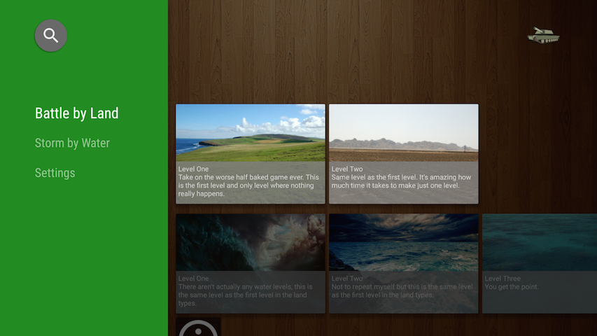
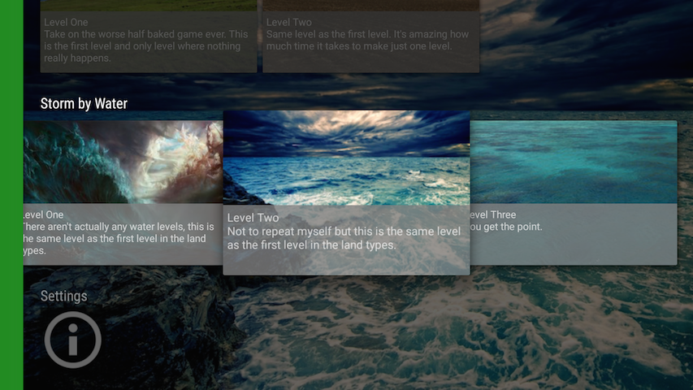
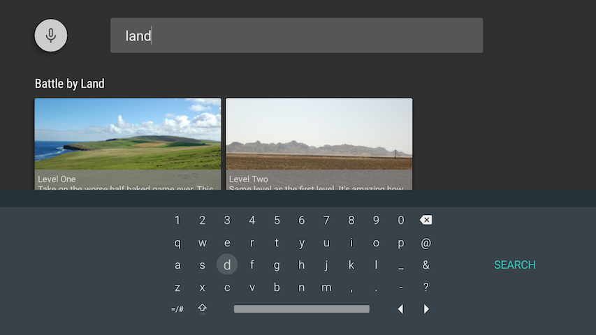
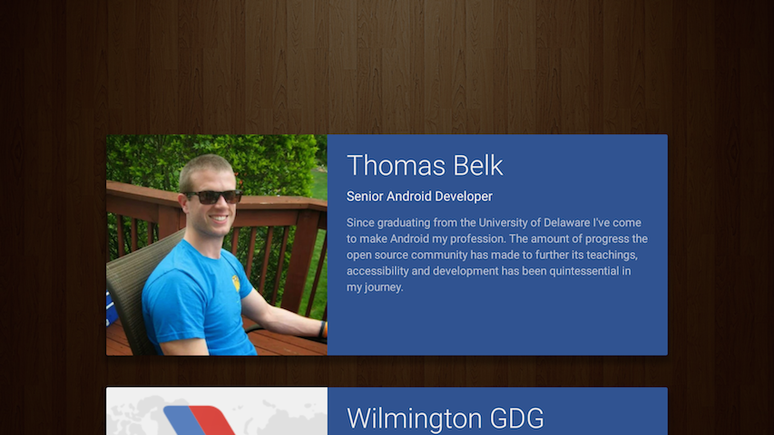
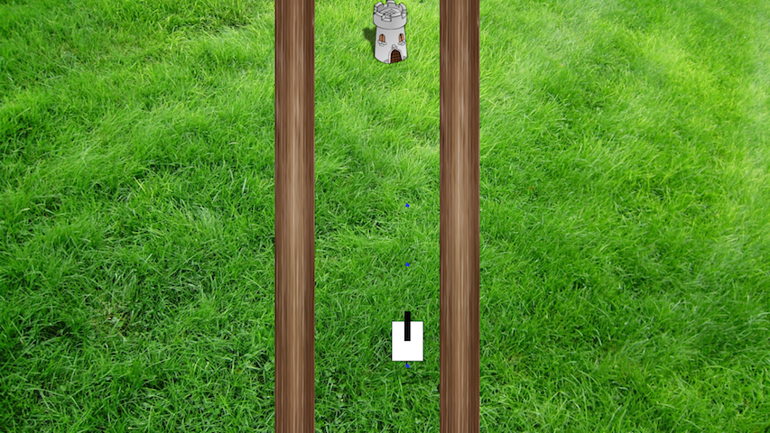

TickTank
========

Android TV project that focuses on the new leanback v17 support library and its applicability to Android TV; menu wise. This project also contains a small but expandable 2D game that demos gamepad controller logic.

Screen Shots
==============

